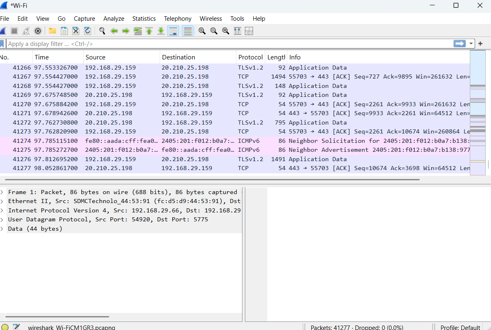
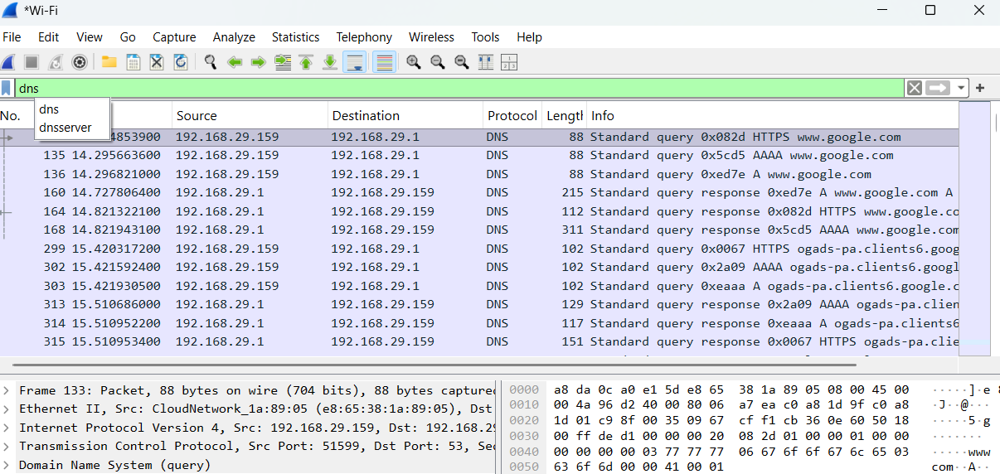
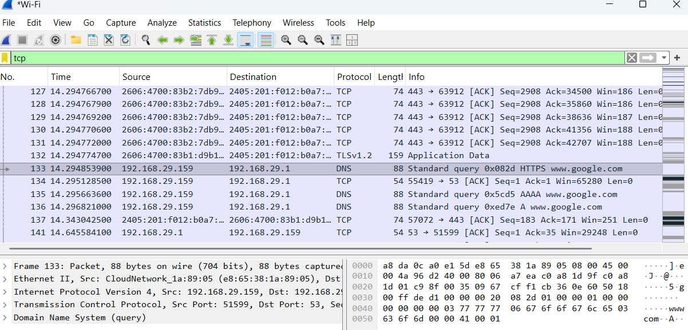
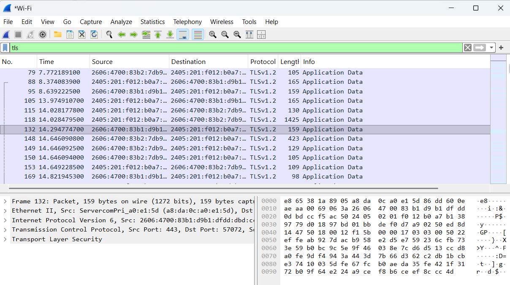
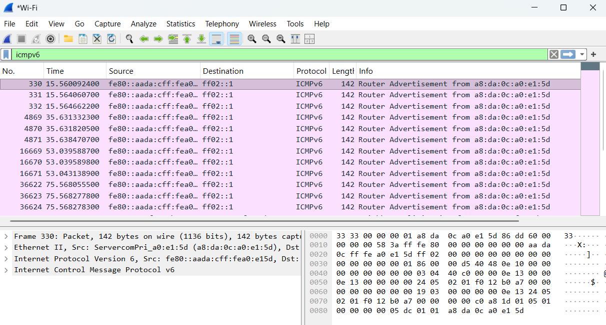

# Network-Traffic-Analysis
Objective: Capture and analyze network traffic to identify unusual patterns, malware, or signs of an attack.

## Tools Used
- Wireshark
- Npcap
- Windows Command Prompt

## Methodology
1. Installed Wireshark.
2. Captured network traffic through Wi-Fi.
3. Generated web browsing traffic.
4. Applied protocol filters.
5. Analyzed packet behavior.

## Protocols Observed

### DNS (Domain Name System)
Converts domain names into IP addresses.

### TCP (Transmission Control Protocol)
Provides reliable communication between devices.

### TLS (Transport Layer Security))
Encrypts web traffic over internet.

### ICMP (Internet Control Message Protocol)
Used for network diagnostics and ping operations.

## Screenshots

### Packet Capture

### DNS Traffic

### TCP Traffic

### TLS Traffic

### ICMP Traffic

## Observation
- No signs of network attacks detetcted.
- No malicious traffic was detected.

## Conclusion
Network traffic was successfully captured and analyzed using Wireshark. The project demonstrated packet sniffing, protocol analysis, and basic network monitoring techniques.
